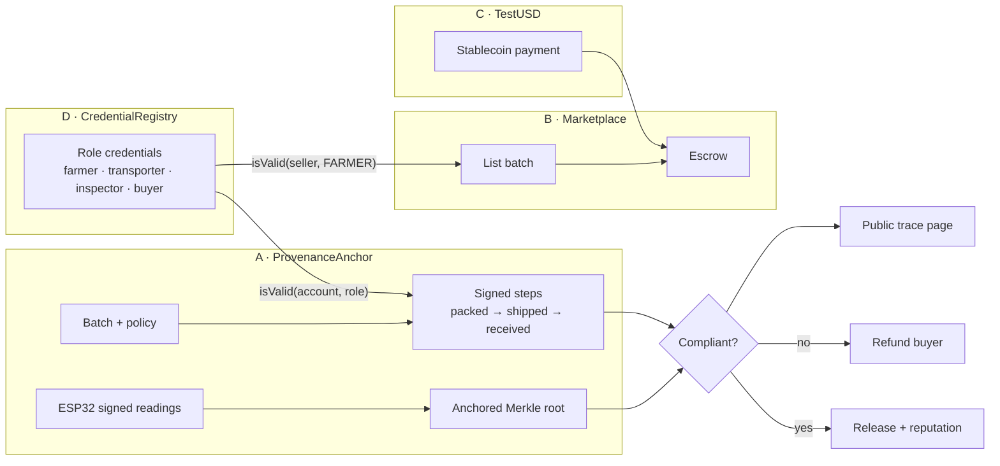

[↑ Overview](../README.md) · [Run the demo](../DEMO.md) · [Tests](../TESTING.md) · [Live demo site](app/README.md)

# Trust stack

Four small, tested projects that work together to move a batch of produce from farm to buyer with proof at every step. One demo shows all of them.

## The demo story

1. **Credentials (D).** A cooperative issues role credentials to a farmer, a transporter, an inspector and a buyer.
2. **Provenance and traceability (A).** The farmer creates a batch of tomatoes under a product policy (2–8 °C, at most 48 hours in transit, inspection required). Each step (packed, inspected, shipped, received) is recorded by an actor holding the right role, in the right order. An ESP32 in the crate signs temperature readings, and their Merkle root is anchored for the batch.
3. **Marketplace (B).** The farmer lists the batch. Only credentialed sellers can list.
4. **Payment rail (C).** The buyer pays in TestUSD, held in escrow.
5. **Settlement.** On delivery the batch is checked against its policy.
   - Compliant: escrow releases payment and the seller's reputation goes up.
   - Not compliant (a signed reading outside 2–8 °C, proved with its Merkle proof, or a missing step or wrong role): the buyer is refunded.
6. **Trace page.** Anyone can enter the batch id, or scan its QR code, to see the journey, who signed each step, and the compliance status.



## How the parts connect

Defined in week 6 in `INTERFACES.md`, with mocks for D and A so the marketplace can be tested before they exist.

| Interface | Used by | Purpose |
|-----------|---------|---------|
| `ICredentialRegistry.isValid(account, role)` | A, B | Is this actor allowed to do this step, or to sell? |
| `IProvenance.createBatch(product, policyId)` | farmer | Start a batch under a product policy |
| `IProvenance.recordEvent(batchId, stage, dataRoot)` | farmer, transporter, inspector, buyer | Signed step in the journey, in order |
| `IProvenance.batchStatus(batchId)` | B, trace page | Pending, compliant or non-compliant |
| `IProvenance.reportViolation(batchId, reading, signature, proof)` | anyone | Prove an out-of-range reading and fail the batch |
| `IMarketplace.list(batchId, price)` | seller | List a batch for sale in TestUSD |

## Build order

| Week | What gets added | Integration test covers |
|------|-----------------|-------------------------|
| 5 | `TestUSD.sol` (C) | — |
| 6 | `INTERFACES.md`, `POLICY.md`, mocks, `Marketplace.sol` (B) | — |
| 7 | `test/Integration.t.sol`, `scripts/demo.sh` | mock credential → list → pay → release |
| 9 | `CredentialRegistry.sol` (D) replaces its mock | real roles |
| 10 | `ProvenanceAnchor.sol` (A) replaces its mock, ESP32 signing | batch, steps, signed sensor root |
| 11 | Compliance check, trace page, deploy to Base Sepolia | compliant batch releases; failing batch refunds |
| 12 | Your own proof-of-learning credentials from `progress.json` (D) | — |

## Start the Foundry project (week 5)

`foundry.toml` is already here. From the repo root, add Foundry's standard library once:

```bash
git submodule add https://github.com/foundry-rs/forge-std trust-stack/lib/forge-std
git commit -m "trust-stack: add forge-std"
```

Anyone cloning the repo later runs `git submodule update --init --recursive` (Codespaces and CI do this for you). Then write `src/TestUSD.sol` and its tests. As soon as there's a contract in `src/`, CI starts running the tests, Slither and the demo on every push.

## Run it

```bash
make test        # unit, fuzz, invariant and attack tests
make demo        # the story on a fresh local chain, as far as it's built
make smoke       # checks the live Base Sepolia deployment (week 11)
```

Anyone else can watch, run in the browser, or run locally: see [DEMO.md](../DEMO.md). Test plan: [TESTING.md](../TESTING.md). Demo stages: [script/demo/README.md](script/demo/README.md). Firmware checks: [firmware/README.md](firmware/README.md).
